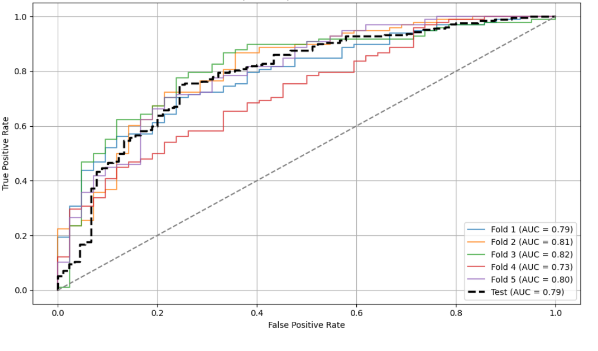
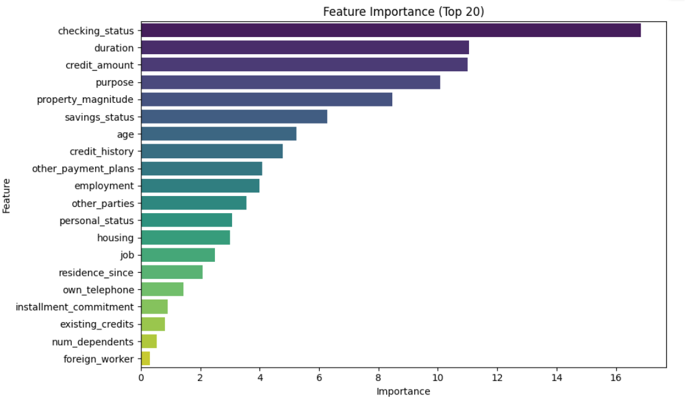

# German Credit Risk Prediction

  
 

 This repository contains the implementation of a machine learning model for predicting credit risk using the German Credit dataset. The dataset consists of various attributes such as age, sex, job, credit history, and more to predict whether a person has a good or bad credit risk. The original dataset contains 1000 entries with 20 categorial/symbolic attributes prepared by Prof. Hofmann.

## Dataset

The dataset used in this project is the [German Credit Data](https://archive.ics.uci.edu/ml/datasets/Statlog+(German+Credit+Data)), which contains 1,000 observations with 20 features. The target variable is a binary classification where the output indicates whether a person has good or bad credit risk.

### Features:
- `Age`: Age of the applicant
- `Sex`: Sex of the applicant
- `Job`: Type of job the applicant holds
- `Credit history`: Whether the applicant has a credit history
- `Purpose`: Purpose of the credit
- `Balance`: Current balance in the applicant's checking account
- A full description of the data can be found at the [link](https://github.com/ovttiras/German-Credit-Risk/blob/main/docs/German_Credit_Data%20set%20Description.pdf)

## Project Description

This project aims to build a machine learning model to predict whether a given individual will have good or bad credit. The project involves the following steps:
1. **Data Preprocessing**: Cleaning the data, handling missing values, and encoding categorical features.
2.  **Model Training**: Building and training machine learning models such as Gradient Boosting.
3. **Evaluation**: Evaluating the performance of the model using metrics such as accuracy, precision, recall, and F1-score.
4. **Feature Importance**  A benefit of using gradient boosting is that after the boosted trees are constructed, it is relatively straightforward to retrieve importance scores for each attribute.

## Results

The results of this project are evaluated based on the following metrics:
**Cross-validation (train set):**
- AUC-ROC   : 0.7886 ± 0.0328
- F1-score  : 0.8315 ± 0.0154
- Precision : 0.7876 ± 0.0214
- Recall    : 0.8816 ± 0.0278
**Test set:**
- AUC-ROC:   0.7826
- F1-score:  0.8383
- Precision: 0.8035
- Recall:    0.8762
  

  
 

The final model can predict whether an applicant has a good or bad credit risk with a high degree of accuracy.

## Feature Importance

Feature Importance is presented below

  
 

## Contributing

Feel free to fork the repository, make changes, and submit pull requests. All contributions are welcome!

## License

This project is licensed under the MIT License - see the [LICENSE](LICENSE) file for details.

## Acknowledgments

- The [UCI Machine Learning Repository](https://archive.ics.uci.edu/ml/datasets/Statlog+(German+Credit+Data)) for providing the German Credit dataset.
- [Scikit-learn](https://scikit-learn.org/) for providing machine learning tools and algorithms.

